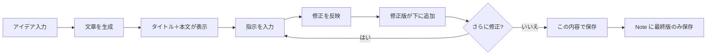

# 文章の微修正＋最終版のみ保存 機能プラン

## 1. 目的・ゴール

- **一度できた文章に指示を出しながら微修正**できるようにする。
- **元の文章は残しつつ**、指示ごとに**修正版が下に追加**され、下に伸びていく形にする。
- 画面が**煩雑になりすぎない**ようにする。
- **最後に仕上がった文章だけ**を保存できるようにする。
- 将来的に、**修正履歴をブログ・文章・プロンプトの精度向上**に活かせる仕立てにする。

---

## 2. ユーザーフロー（想定）

1. ユーザーが「文章を生成」でタイトル・本文を出す（現状どおり）。
2. その下に「微修正」用の**指示入力欄**を設ける。
3. ユーザーが指示（例：「もっと短く」「結論を先に」）を入力し、「修正を反映」を押す。
4. API が「現在のタイトル＋本文」と「指示」を受け取り、修正後のタイトル＋本文を返す。
5. **修正後の文章を、元の文章の下にブロックとして追加**する（元の文章は残す）。
6. 3〜5 を繰り返すと、**上から下へ**「初回生成 → 修正1 → 修正2 → …」と伸びていく。
7. **「この内容で保存」**ボタンは、**いちばん下（最後の修正版）の内容**だけを Note に保存する。保存後は、必要に応じてフォームをリセットまたは履歴をクリア。

---

## 3. UI 設計（煩雑さを避ける）

### 3.1 基本形：縦に伸びる「ブロック」リスト

- **ブロック** = 1本の「タイトル＋本文」の塊。
- 先頭ブロック = 初回生成。その下に「修正1」「修正2」… が順に追加される。
- 各ブロックは **見出し＋本文のプレビュー** だけ表示し、本文全体は **クリックで展開** するか、**直近 1〜2 件だけ全文表示** にしてそれ以外は「修正 N」の折りたたみにすると、煩雑になりにくい。

### 3.2 案 A：シンプル版（まず実装しやすい）

- **常に「現在のタイトル・本文」を 1 セットだけ編集可能なフィールドで表示**（現状のタイトル input と本文 textarea）。
- 初回生成時：その内容を「現在」にセット。
- 「微修正」欄に指示を入力 → 「修正を反映」 → API が返した結果を**新しい「現在」**に上書きし、**履歴リストに「1つ前のスナップショット」を 1 件追加**（タイトルだけ、またはタイトル＋本文の先頭 1 行を表示）。
- 履歴は「修正1」「修正2」… と**折りたたみ**で並べ、クリックで展開すると当時のタイトル・本文を読める（編集は不可。あくまで参照用）。
- 「この内容で保存」＝ 今編集可能な「現在」のタイトル・本文を Note に保存。

**メリット**: 実装が軽い。常に編集できるのは 1 セットだけなので迷わない。  
**デメリット**: 「元の文章を残す」は履歴側に残る形になり、メインの編集エリアは「常に最新」のみ。

### 3.3 案 B：ブロックが下に伸びる版（要望に近い）

- 初回生成 → **ブロック1**（タイトル＋本文）を追加。
- 指示を入力して「修正を反映」→ **ブロック2** を下に追加（修正後）。ブロック1 はそのまま上に残す。
- 同様に **ブロック3, 4, …** が下に伸びる。
- 各ブロックは「修正 N」のようなラベル＋タイトル＋本文（短いプレビュー or 全文）。**最新ブロックだけ編集可能**にしてもよいし、すべて読み取り専用にして「微修正」でしか変えなくてもよい。
- 「この内容で保存」＝ **いちばん下のブロック**のタイトル・本文を Note に保存。
- 煩雑さ対策：**表示するブロック数を制限**（例：直近 5 件だけ表示し、それより前は「過去の修正を見る」で開く）か、**古いブロックは初期状態で折りたたみ**（見出しだけ表示）。

**メリット**: 「元の文章を残したまま下に伸びる」がそのまま実現できる。  
**デメリット**: ブロック数が増えると UI 設計と状態管理がやや重くなる。

### 3.4 推奨

- **まずは案 A** で実装し、「現在 1 セット ＋ 履歴（折りたたみ）」で「元の文章は履歴で残る」「最後の仕上がりだけ保存」を満たす。
- 運用してみて「ブロックが下に伸びる」表示が欲しくなったら **案 B** に拡張する、という段階が扱いやすい。

---

## 4. データ・API

### 4.1 微修正用 API（新規）

- **POST /api/ai/refine**
- 入力: `{ personaId, title, body, instruction }`
- 処理: 現在のタイトル・本文と指示を AI に渡し、「この指示に従って修正したタイトルと本文」を返す。
- 出力: `{ title, body }`（既存の generate と同形式でよい）。

プロンプト例:  
「以下のブログ記事のタイトルと本文を、ユーザーの指示に従ってのみ修正してください。指示にない部分は変えず、指示の内容だけを反映した結果のタイトルと本文を、1行目がタイトル・2行目空行・3行目以降が本文の形式で返してください。」

### 4.2 クライアント側の状態

- **案 A**  
  - `currentTitle`, `currentBody`（編集可能な「現在」）  
  - `history: { title, body }[]`（過去のスナップショット。保存はしない）  
- **案 B**  
  - `blocks: { title, body }[]`（先頭が初回、末尾が最新）。保存時は `blocks[blocks.length - 1]` を使う。

### 4.3 保存（Note）

- **変更なし**。保存時は「最終版の title, body, seedWords」だけを Note に保存（現行の createNote の仕様を維持）。
- 微修正の履歴（指示や途中版）は **DB には保存しない**（まずはセッション／クライアント内だけ）。必要になったら後から「履歴を保存する」機能を検討。

---

## 5. 将来：プロンプト・精度向上に活かす

- **フェーズ 2** として、次のような拡張を考えられる。
  - 微修正時に「**指示**」と「**修正前 title+body**」「**修正後 title+body**」をログとして保存する（別テーブルや JSON で保持）。
  - 蓄積したペアを分析したり、**ペルソナのプロンプト・ルール**を「こういう指示のときはこう直す」ようにチューニングする材料にする。
  - または、**保存時だけ**「最終版＋最後に使った指示」を Note にメタデータとして持たせ、後から「どんな指示で仕上げたか」を参照できるようにする。

これらは**いきなり実装せず**、まずは「微修正＋最終版のみ保存」を動かしてから、必要に応じて設計を決める形でよい。

---

## 6. 実装の順序（案）

1. **API**: `POST /api/ai/refine` を追加（`lib/ai.ts` に `refineArticle(title, body, instruction)` のような関数を追加し、既存の generate と同様に provider 分岐）。
2. **書く画面**: 「文章を生成」の下に「微修正」セクションを追加。  
   - 指示入力用のテキスト欄と「修正を反映」ボタン。  
   - 案 A の場合：表示中の title/body を API に送り、返ってきた結果で表示を更新し、履歴配列に 1 件 push。履歴は折りたたみリストで表示。
3. **保存**: 「この内容で保存」が、現在表示している最終版（案 A なら現在の 1 セット、案 B なら最後のブロック）の title, body, seedWords で createNote を呼ぶようにする。
4. （任意）履歴の折りたたみ／展開、ブロック数制限などの UI 調整。
5. （将来）修正ログの保存やプロンプト改善は別タスクとして設計・実装。

---

## 7. まとめ

| 項目 | 方針 |
|------|------|
| 元の文章を残す | 案 A: 履歴として保持。案 B: 上から下にブロックで残す。 |
| 下に伸びる | 案 A: 履歴リストが伸びる。案 B: ブロックが下に追加される。 |
| 煩雑にしない | 履歴／古いブロックは折りたたみ or 件数制限。 |
| 保存する内容 | 最終版のタイトル・本文・seedWords のみ（Note は現状どおり）。 |
| 将来の精度向上 | 修正ペアのログ保存・分析はフェーズ 2 で検討。 |

まずは **案 A（現在 1 セット ＋ 履歴）** で実装し、必要なら案 B に拡張する流れを推奨する。
